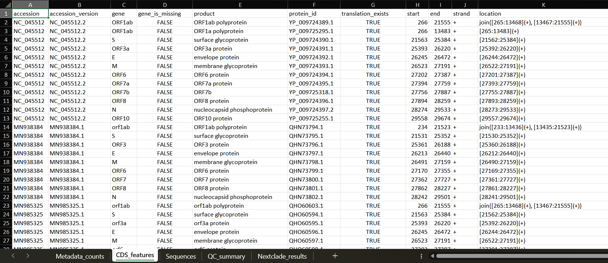

# Журнал разработки проекта

> Журнал ведется постфактум с 1 по 4 день.

## День 1

Я исследовал дипломную работу, которая лежит по директории `SARS2_Bioinformatics_Project/manual_notes/Diplom`.

Я ознакомился с литературой, а также поверхностно прочитал про все программы, в которых проводился ручной анализ. Далее я составил для себя план: повторить эту работу, но сделать анализ автоматическим и быстрым.

## День 2

В этот день я реализовал скрипт, который анализирует GenBank-файл, в котором первоначально было собрано 35 штаммов. Все данные я записал в первый лист Excel-файла - `Metadata_counts`.

В этом листе есть:

- названия штаммов;
- их конкретные версии;
- описание;
- страна;
- конкретное местоположение: страна повторяется, если более точной геолокации обнаружено не было;
- дата секвенирования / сбора образца;
- носитель вируса;
- изоляты;
- подсчет всех нуклеотидов.

В том числе ведется подсчет `N`. `N` означает, что конкретный нуклеотид в этой позиции распознать не получилось. В этом же листе считаются проценты каждого нуклеотида в последовательности.

Следующий лист - `CDS_features`. В нем вся информация также была извлечена из GenBank-файла, то есть вручную я анализ последовательностей здесь не проводил. Чтобы не повторяться, я прикрепляю скриншот, на котором можно посмотреть реализованный на тот момент функционал этого листа.

Следующий лист - `Sequences`. Это извлеченные последовательности, относящиеся к каждому штамму.

## День 3

На третий день я добавил реализацию автоматического форматирования столбцов по максимальной длине строки.

Помимо этого, я разбил скрипт на несколько файлов, чтобы поддержать структуру ООП.

Также я начал реализацию самостоятельного поиска мутаций и выравнивания, на что потратил огромное количество времени.

Был реализован лист `QC_summary`. Изначально он в основном был необходим для работы с мутациями, но на следующем этапе разработки я успешно доработал его уже после исключения этого функционала непосредственно из пайплайна.

## День 4

На четвертый день я откатил все изменения до состояния второго дня и оставил код в отдельной ветке с коммитами. Ветка называется `backup-before-reset`.

Я столкнулся с недопониманием с точки зрения биологии: как именно корректно производить подсчет мутаций. Поэтому я решил обращаться к программе `Nextclade CLI`.

Для безопасности разработки я решил вести этот шаг в отдельной ветке, которую назвал `attempt-to-connect-with-external-app`.

Я изучил работу с ней и успешно смог получить полноценный `.tsv`-файл, который затем спарсил в Excel-таблицу `Nextclade_results`.

Также в этот же день я понял, что помечал данные `N/A` как пустоту, и исправил это.

Я заметил одну тревожную деталь: в скачанном через `Nextclade` датасете референс-штамм назывался `MN908947`, а в дипломной работе, над улучшением функционала которой я работаю, референс-штамм назывался `NC_045512`.

Я проверил GenBank-файл и обнаружил, что там указано: это эквивалентные нуклеотидные последовательности. Чтобы быть уверенным, я дополнительно проверил это отдельным скриптом. Этот скрипт не зафиксирован в Git-истории, поскольку я посчитал его однозначно мусорным вспомогательным файлом.

## День 5

На пятый день я сделал масштабный файл `nextclade_summary`, где я разделил огромную таблицу на `102` столбца на несколько других небольших таблиц для более удобного анализа.

Также был реализован скрипт, который парсит Excel-файл и производит сравнение с фиксированными результатами, полученными в дипломе.

Было реализовано обращение к Nextclade с целью получить выравненные последовательности. Я их вывел в файл `aligned.fasta`, где можно для наглядности удобно посмотреть внутренний резулльтат работы алгоритмов программы Nextclade. Я также спарсировал эти данные в Excel-лист в общем Excel-файле, однако, к сожалению, формат данных не позволяет комфортно визуально рассмотреть результаты. Тем не менее этот лист я оставил в Excel-файле.

## День 6

На шестой день я продолжил разбираться с огромным количеством информации, которую выдает `Nextclade`.

Я начал делать расширенные summary-таблицы, потому что исходный лист с результатами был слишком большим и неудобным для спокойного анализа. Данные были разложены на эти части: отдельно общая сводка, отдельно мутации, отдельно проблемы качества и другие показатели.

В этот же день я добавил формирование отдельного `.md`-отчета. Сначала он был довольно перегруженным, теперь можно не только смотреть на таблицы, но и быстро понимать, что именно получилось после запуска программы.

Также я начал сравнивать автоматические результаты с тем, что было зафиксировано в дипломной работе. Это был интересный момент, потому что программа уже не просто создавала файлы, а начинала проверять себя относительно исходной ручной работы.

## День 7

На седьмой день я продолжил работу с отчетами и выравненными последовательностями.

Я сделал отчет менее перегруженным, убрал лишнюю плотность и оставил только важную и наглядную информацию.

Также был добавлен файл с демонстрацией выравненных последовательностей. Для этого я использовал возможность `Nextclade` создавать `aligned.fasta`. Цель этого дополенния была в том, чтобы можно было наглядно оценить работу выравнивания.

В этот период я также подправил `README`, чтобы постепенно фиксировать команды и ход работы. 

## День 8

На восьмой день я занялся филогенетической частью и подготовкой файлов для `PopART`.

Я добавил скрипты, которые создают файлы для дальнейшей работы с филогенетическими сетями. Это был новый этап проекта: до этого основная работа шла вокруг Excel, Nextclade и отчетов, а теперь программа будет работать с визуализацией данных. Однако я принял решение не рисовать филогенетические деревья и сети непосредственно в программе, поскольку этот процесс очень интеративный, и я считаю, что оформлять внешний вид и структуру лучше самостоятельно с помощью готовых инструментов. Моя программа выдает лишь необходимую информацию для построения скелета филогенетическиз визуальных данных.

Параллельно появились README-файлы для этих результатов. Они нужны преимущественно для отладки.

## День 9

На девятый день я впервые реализовал работу с `Docker`.

Также я продолжил дописывать документацию. После добавления Docker проблема отсутствия зафиксированных команд для терминала стала особенно востребованной.

Далее я перепроверил функциональнось и оптимизировал качество кода в проекте.

## День 10

На десятый день я сделал крупную перестройку структуры проекта.

Изначально проект был почти полностью ориентирован на SARS-CoV-2, а потенциально - на все возможные вирусы, доступные в Nextclade, но дальше появилась задача работать еще с туберкулезом. Поэтому я начал переводить код и папки на структуру, где разные организмы находятся отдельно друг от друга.

Появилось разделение на `covid_data` и `tuberculosis_data`. 

На этот день это было конечным нововведением, поскольку почти все время ушло на переписывание новых путей в уже существующих скриптах.

## День 11

На одиннадцатый день я продолжил доводить филогенетическую часть и основные команды проекта.

Я исправил генераторы README для филогенетики и добавил все основные CLI-команды в главный `README`. 

Также я улучшил автоматический отчет. Он стал учитывать больше исследуемых данных и стал заметно удобнее для чтения.

Отдельно я добавил валидацию при генерации `.nex`-файлов. Это было достаточно неожиданной правкой для меня, поскольку я сразу же наткнулся на проблему с неполнотой данных во время работы с 932 последовательностями. При работе с 35 последовательностями, которые фигурировали в качестве моих исходных данных ранее, никаких недостатков данных не было.

## День 12

На двенадцатый день я занимался порядком в репозитории и окончательным разделением данных.

Я убрал из отслеживания Git часть больших и промежуточных файлов, оставив их локально на диске. Это позволило не перегружать репозиторий результатами анализа, которые генерируются повторно.

После этого я продолжил приводить к нормальному виду разделение COVID- и TB-частей. Файлы, относящиеся к коронавирусу, были перенесены в `covid_data`, а данные для туберкулеза стали храниться в `tuberculosis_data`.

В этот же период я начал готовить основу для работы с туберкулезными accession-данными. 

## День 13

Я добавил масштабную подготовку данных для дальнейшего анализа: манифесты, FASTA-входы, проверки и файлы, которые затем можно использовать для запуска `Snippy`.

После этого появилась возможность строить дерево для исследуемых штаммов туберкулеза. В проект вошла связка `Snippy` и `FastTree`: сначала создаются результаты по вариантам, затем по core SNP alignment строится дерево.

Также я добавил файлы для загрузки в `iTOL`, чтобы дерево можно было дополнять метаданными и смотреть его более наглядно.

В этот же день появился отдельный отчет по анализу туберкулеза и модуль для анализа мутаций. 

## День 14

На четырнадцатый день я занимался последними штрихами в разработке программы.

Сначала я привел несколько отчетов к единому стилю и оформлению. 

Затем я расширил работу с `Docker`. К этому моменту через Docker уже можно запускать основной функционал проекта: COVID-анализ, подготовку TB-данных, запуск `Snippy`, постобработку, построение дерева, экспорт для `iTOL` и финальные отчеты.

Также я отдельно проверил идею с `TB-Profiler` и решил не делать его обязательной частью текущего пайплайна. Причина в том, что для корректной работы ему нужны raw reads, а в текущем учебном наборе используются сборки. Анализ всех raw reads был бы невыполнимой задачей для моего ноутбука, а на их скачивание у меня бы не хватило места, ведь гипотетически они должны занимать свыше 100 гб. места.

## Планы развития проекта далее

Я планирую доработать проект, чтобы была возможность интерактивно обращаться к функционалу программы. Проект будет иметь полноценный интерфейс, а также будет обращаться к NCBI и инструментам для построения филогенетических данных самостоятельно.

Помимо этого я хочу реализовать возможность анализа абсолютно всех вирусов, доступных в Nextclade. Также в планах добавить работу с другими бактериями.

Также я хочу доработать многие автоматические отчеты, чтобы они были более информативными и удобными для ознакомления, а также улучшить качество кода.